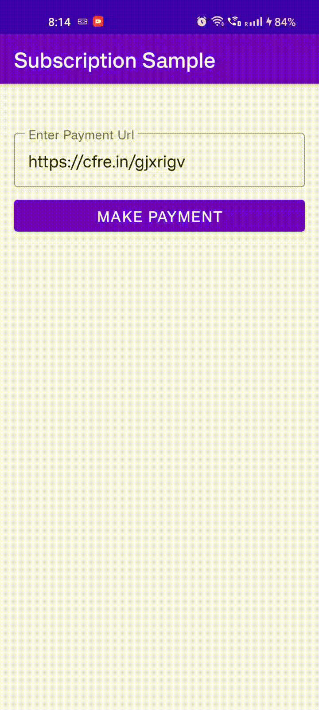

## Subscription Payment For Mobile SDKs
This repository will have subscription payment flow for Android platform.

      

### Sample

### [Android Integration](https://github.com/cashfree/android-subscription-sdk/blob/master/Subscription-sample/app/src/main/java/com/cashfree/susbcription/sample/MainActivityKotlin.kt) 

#### Steps

1. Add Maven url for Cashfree subscription SDK in project level `build.gradle`.

   `maven { url "https://maven.cashfree.com/release"}`

2. Add sdk dependencies in app level `build.gradle`.

   `implementation "com.cashfree.subscription:coresdk:0.0.1"`

3. Register for payment result callback

   `CFSubscriptionPaymentService.setCheckoutCallback(this)`

4. Call `doPayment` with `CFSubscriptionPayment` object.

   `CFSubscriptionPaymentService.doPayment(this, CFSubscriptionPayment(url))`

Click [here](https://docs.cashfree.com/docs/subscription-android-sdk) for more Documentation.

## Getting help

If you have questions, concerns, bug reports, etc, you can reach out to us using one of the following

1. File an issue in this repository's Issue Tracker.
2. Send a message in our discord channel. Join our [discord server](https://discord.gg/znT6X45qDS) to get connected instantly.
3. Send an email to care@cashfree.com

## Getting involved

For general instructions on _how_ to contribute please refer to [CONTRIBUTING](CONTRIBUTING.md).

----

## Open source licensing and other misc info
1. [LICENSE](https://github.com/cashfree/android-subscription-sdk/blob/master/LICENSE.md)
2. [CODE OF CONDUCT](https://github.com/cashfree/android-subscription-sdk/blob/master/CODE_OF_CONDUCT.md)

