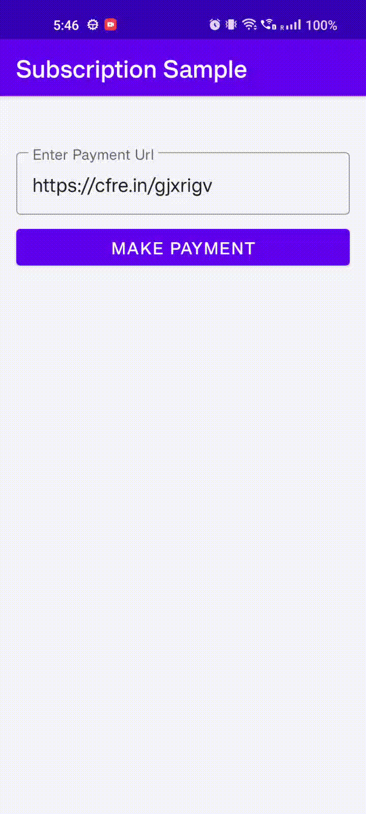

## Subscription Payment Sample

### Sample Video

### [Android Integration](https://github.com/cashfree/android-subscription-sdk/blob/master/Subscription-sample/app/src/main/java/com/cashfree/susbcription/sample/MainActivityKotlin.kt) 

#### Steps

1. Add Maven url for Cashfree subscription SDK in project level `build.gradle`.

   `maven { url "https://maven.cashfree.com/release"}`

2. Add sdk dependencies in app level `build.gradle`.

   `implementation "com.cashfree.subscription:coresdk:0.0.1"`

3. Register for payment result callback

   `CFSubscriptionPaymentService.setCheckoutCallback(this)`

4. Call `doPayment` with `CFSubscriptionPayment` object.

   `CFSubscriptionPaymentService.doPayment(this, CFSubscriptionPayment(url))`

### [Sample Kotlin](https://github.com/cashfree/android-subscription-sdk/blob/master/Subscription-sample/app/src/main/java/com/cashfree/susbcription/sample/MainActivityKotlin.kt)
### [Sample Java](https://github.com/cashfree/android-subscription-sdk/blob/master/Subscription-sample/app/src/main/java/com/cashfree/susbcription/sample/MainActivityJava.java)

Click [here](https://docs.cashfree.com/docs/subscription-android-sdk) for more Documentation.
